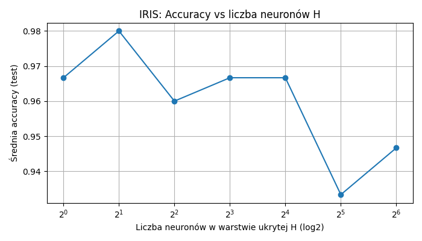
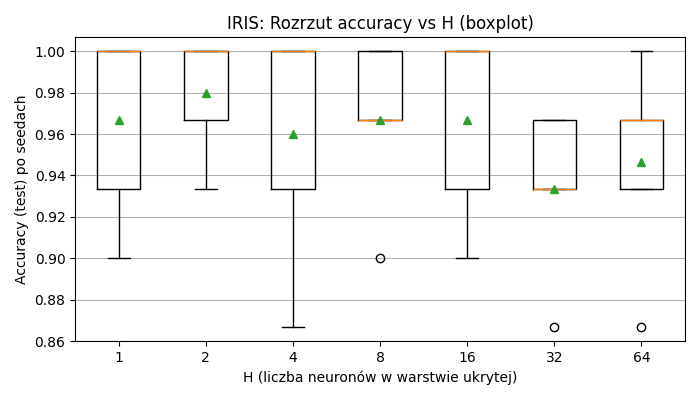
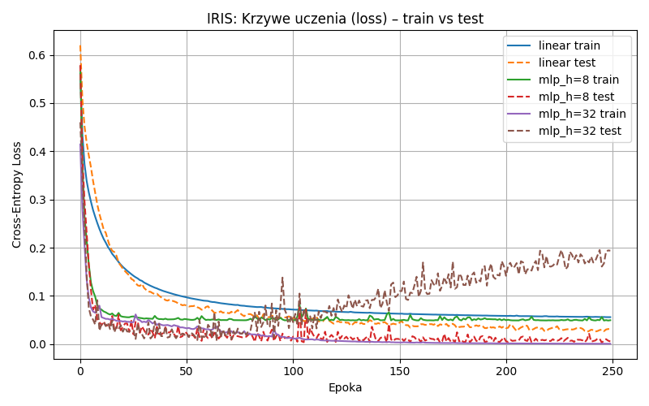
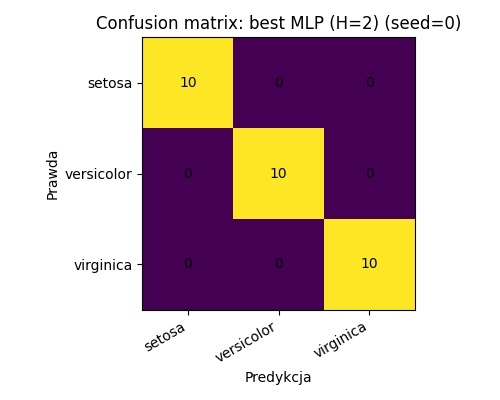
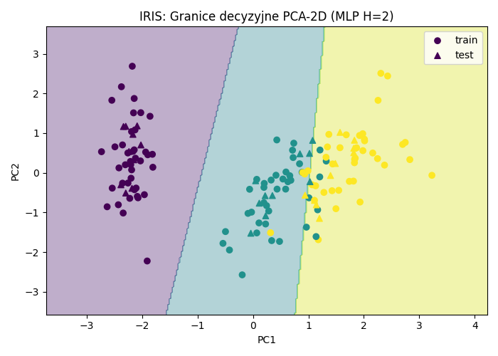

# 🌸 IRIS Classification — Linear vs MLP (PyTorch)

**Experimental classification of the IRIS dataset** using **PyTorch**, comparing a **single-layer linear classifier** with a **Multi-Layer Perceptron (MLP)** and analyzing the influence of the hidden layer size **H** on classification quality and stability.

📄 **Report (PDF):** [Sprawozdanie.pdf](Sprawozdanie.pdf)   
📊 **Outputs:** plots + CSV tables saved automatically after each run (`runs/...`)  

---

## 🎯 Goal
This project answers two questions:  
- How well does a **linear (single-layer) model** classify IRIS compared to an **MLP**?  
- How does the number of hidden neurons **H** affect **accuracy**, **variance across seeds**, and **overfitting**?  

---

## 🌿 Dataset (IRIS)  
IRIS contains **150 samples**, each described by **4 features** (sepal/petal length & width) and belonging to **3 classes**:  
*setosa*, *versicolor*, *virginica*.  

Source: UCI Machine Learning Repository   
https://archive.ics.uci.edu/dataset/53/iris  

---

## 🧠 Models
### 🔹 Linear classifier (single-layer)  
`Linear(4 → 3)`  
  
trained with **CrossEntropyLoss** (softmax handled internally).  

### 🔹 MLP (one hidden layer)  
`Linear(4 → H) → ReLU → Linear(H → 3)`  

Tested hidden sizes:  
  
`H ∈ {1, 2, 4, 8, 16, 32, 64}`  

---

## ⚙️ Experiment setup
- Train/test split: **80/20**, **stratified**  
- Feature scaling: **StandardScaler** (fit on train, applied to test)  
- Optimizer: **Adam**  
- Loss: **CrossEntropyLoss**  
- Epochs: **250**  
- Batch size: **16**  
- Multiple random seeds to estimate stability (**mean ± std**, boxplots)  

---

## 📊 Results (mean ± std across seeds)

| Model  | H  | Accuracy (mean ± std) |
|--------|----|------------------------|
| linear | —  | 0.9733 ± 0.0327 |
| MLP    | 1  | 0.9667 ± 0.0422 |
| MLP    | 2  | **0.9800 ± 0.0267** |
| MLP    | 4  | 0.9600 ± 0.0533 |
| MLP    | 8  | 0.9667 ± 0.0365 |
| MLP    | 16 | 0.9667 ± 0.0422 |
| MLP    | 32 | 0.9333 ± 0.0365 |
| MLP    | 64 | 0.9467 ± 0.0452 |

✅ Best average result: **MLP with H=2**    
⚠️ Larger models (e.g. **H=32**) show signs of worse generalization / overfitting on this small dataset.  

---

## 📈 Visualizations

## 📊 Visualizations

### Accuracy vs hidden size (H)


### Stability across seeds (boxplot)


### Learning curves (train vs test loss)


### Confusion matrices (linear vs best MLP)



### PCA-2D decision regions (intuition / visualization)


---

## 📂 Output files
Each run creates a timestamped folder under `runs/` with:  
- **figs/** — plots (`.png`)  
- **tables/** — results tables (`.csv`) + confusion matrices (`.txt`)  
- **models/** — saved weights (`.pt`)  

Example:
```text
.
├─ main.py
├─ Sprawozdanie.pdf
├─ results_summary.csv
├─ results_per_seed.csv
├─ config.json
├─ runs/
│  └─ iris_YYYYMMDD_HHMMSS/
│     ├─ figs/
│     ├─ tables/
│     └─ models/
└─ assets/
   ├─ acc_vs_hidden.png
   ├─ boxplot_acc_vs_hidden.png
   ├─ learning_curves_loss.png
   ├─ cm_compare.png
   └─ pca_decision_regions.png
```

---

## ▶️ Running the project
Install dependencies:   
`pip install numpy torch matplotlib scikit-learn`  
Run:   
`python main.py`
Outputs will be saved under:   
`runs/iris_<timestamp>/`

---

###🧑‍💻 Author
 
Created by Avuii  
